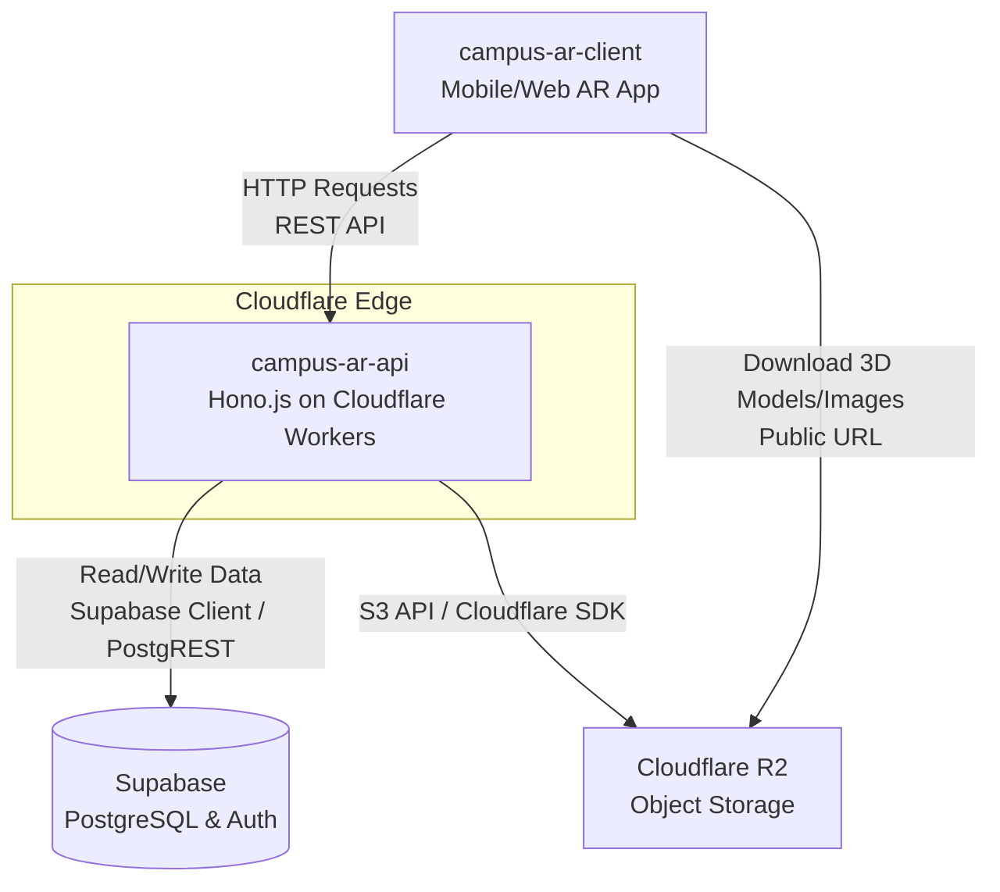

# Campus AR API - アーキテクチャ設計書

## 1. システム全体構成

Campus AR プロジェクトは、キャンパス内でAR（拡張現実）体験を提供するアプリケーションです。本リポジトリ（`campus-ar-api`）は、クライアントからのリクエストを処理し、データベースやストレージと連携するバックエンドAPIとして機能します。

### 技術スタック
*   **Web Framework:** [Hono.js](https://hono.dev/) (エッジ向けに最適化された軽量フレームワーク)
*   **Deployment / Runtime:** [Cloudflare Workers](https://workers.cloudflare.com/)
*   **Database & Authentication:** [Supabase](https://supabase.com/) (PostgreSQL)
*   **Object Storage:** [Cloudflare R2](https://www.cloudflare.com/ja-jp/developer-platform/r2/) (ARアセット、3Dモデル、画像などの保存)

## 2. アーキテクチャ図

## 3. コンポーネントの役割

### 1. campus-ar-client (フロントエンド/ARクライアント)
*   ユーザーインターフェースの提供。
*   ARエンジンの実行、カメラ映像からのARマーカー認識、およびARオブジェクトの重畳表示。
*   認識したマーカーIDや現在位置情報の取得とAPIへの送信。
*   認証情報の保持。

### 2. campus-ar-api (本リポジトリ)
*   **ルーティング & コントローラー:** Hono.jsを用いてエンドポイントを定義。
*   **認証・認可ミドルウェア:** リクエストのJWT（Supabase Authで発行）を検証。
*   **ビジネスロジック:** クライアントからのARマーカーIDや位置情報に基づき、該当するARスポット情報やイベント情報を計算・取得。
*   **R2 署名付きURL発行:** プライベートなARアセットへのアクセスが必要な場合、R2の署名付きURLを生成してクライアントに返却。

### 3. Supabase (データベース & 認証)
*   ユーザー情報の管理。
*   キャンパス内の施設、ARスポット（POI: Point of Interest）、イベント情報、ユーザーのAR体験履歴などのリレーショナルデータの保存。
*   Row Level Security (RLS) を用いたセキュアなデータアクセス制御。

### 4. Cloudflare R2 (オブジェクトストレージ)
*   静的ファイル（3Dモデルファイル(`.glb`)、テクスチャ画像、マーカー画像）の保存。
*   エッジネットワークを通じた高速なアセット配信。
