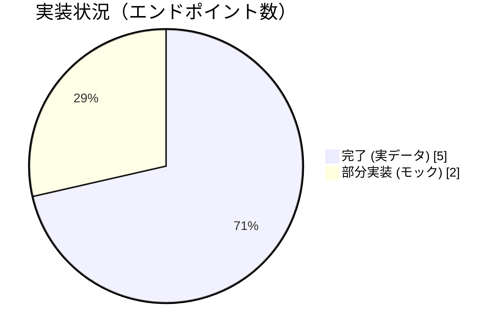
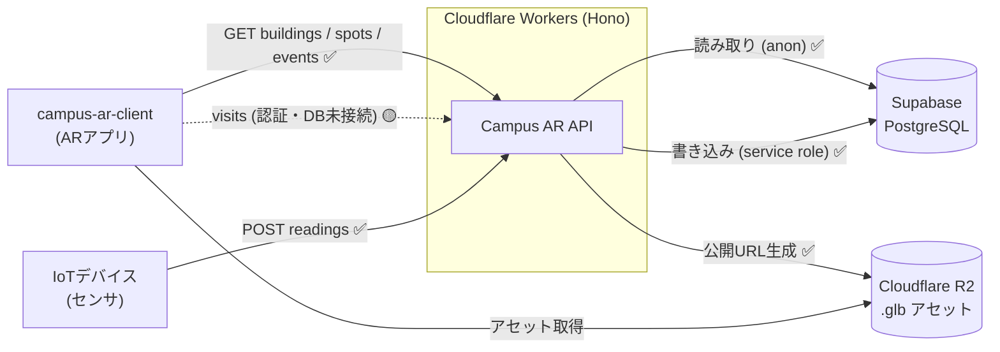

# Campus AR API - 進行状況

> 最終更新: 2026-07-23
> ブランチ運用: `main`（本番） ← `develop`（開発統合） ← 各作業ブランチ

本ドキュメントは開発の進行状況を一目で把握するためのものです。実装の詳細は各ソース・[`docs/specifications.md`](specifications.md) を参照してください。

## 凡例

| 記号 | 状態 |
| :--: | :--- |
| ✅ | 完了（実データ接続・動作確認済み） |
| 🟡 | 部分実装（モックデータ返却、または一部未接続） |
| 🔴 | 未着手 |

## サマリー

- エンドポイント: **7 実装**（うち 5 が実データ接続、2 がモック返却）
- DBスキーマ: **7 モデル定義済み**（マイグレーション 2 件適用）
- 主要な残タスク: ユーザー認証（Supabase Auth / JWT）、訪問記録のDB接続、R2アセット管理

## エンドポイント別ステータス

| 状態 | メソッド | パス | 概要 | データソース |
| :--: | :-- | :-- | :-- | :-- |
| ✅ | GET | `/api/health` | ヘルスチェック | 静的（DB不要） |
| ✅ | GET | `/api/v1/buildings` | 建物一覧（ARマーカー数集計） | Supabase (PostgREST) |
| ✅ | GET | `/api/v1/spots/{marker_id}` | スポット詳細＋ARアセット | Supabase (PostgREST) |
| ✅ | POST | `/api/v1/sensors/{sensor_id}/readings` | センサ計測値の登録（デバイス認証付き） | Supabase (service role) |
| 🟡 | GET | `/api/v1/users/me/visits` | 訪問履歴取得 | **モック** |
| 🟡 | POST | `/api/v1/users/me/visits` | 訪問記録の作成 | **モック** |
| ✅ | GET | `/api/v1/events` | イベント一覧（`upcoming` 絞り込み対応） | Supabase (PostgREST) |

## DBスキーマ（Prisma / PostgreSQL）

| 状態 | モデル / テーブル | 用途 | API接続 |
| :--: | :-- | :-- | :-- |
| ✅ | `Building` / `buildings` | 建物・エリア | buildings, spots |
| ✅ | `Spot` / `spots` | ARマーカー地点 | spots, buildings |
| ✅ | `ArAsset` / `ar_assets` | 3Dモデル等のアセット | spots |
| ✅ | `Sensor` / `sensors` | IoTデバイスメタ情報 | sensors |
| ✅ | `SensorReading` / `sensor_readings` | センサ時系列計測値 | sensors |
| 🟡 | `UserVisit` / `user_visits` | ユーザー訪問履歴 | **API未接続（モック）** |
| ✅ | `Event` / `events` | イベント情報 | events |

マイグレーション:
- `20260709111431_init` — 初期テーブル
- `20260722000000_add_sensors` — `sensors` / `sensor_readings` 追加

## コンポーネント別ステータス

| 状態 | 項目 | 備考 |
| :--: | :-- | :-- |
| ✅ | Hono + OpenAPI 基盤 | Swagger UI (`/doc`), OpenAPI JSON (`/openapi.json`) |
| ✅ | Supabase 読み取り接続 | `supabase-js`（anon key, PostgREST 経由） |
| ✅ | Supabase 書き込み接続 | service role key（RLS バイパス, センサ登録） |
| ✅ | デバイス認証 | `SENSOR_INGEST_KEY`（事前共有キー） |
| ✅ | R2 公開URL生成 | `storage_path` → 公開URL 変換のみ |
| 🟡 | 環境変数・シークレット整備 | `.dev.vars.example` 提供済み |
| 🔴 | ユーザー認証（Supabase Auth / JWT） | `Authorization: Bearer <JWT>` 検証未実装 |
| 🔴 | R2 アセットのアップロード / 管理 | 現状は参照URL生成のみ |
| 🔴 | Cloudflare Workers 本番デプロイ | 未確認 |
| 🔴 | 自動テスト / CI | 未整備 |

## アーキテクチャ（データフロー）

## 今後のロードマップ

1. **ユーザー認証の実装** — Supabase Auth の JWT を検証し、`users/me/visits` を認証必須化する
2. **訪問記録のDB接続** — `user_visits` テーブルへ実データで読み書き（現状モック）
3. ~~**イベントAPIの実装**~~ ✅ 完了 — `GET /api/v1/events`（`events` テーブル配信、`upcoming` 絞り込み対応）
4. **R2アセット管理** — 3Dモデルのアップロード・削除フローの整備
5. **デプロイ / CI** — Cloudflare Workers への本番デプロイ手順確立と自動テスト整備
